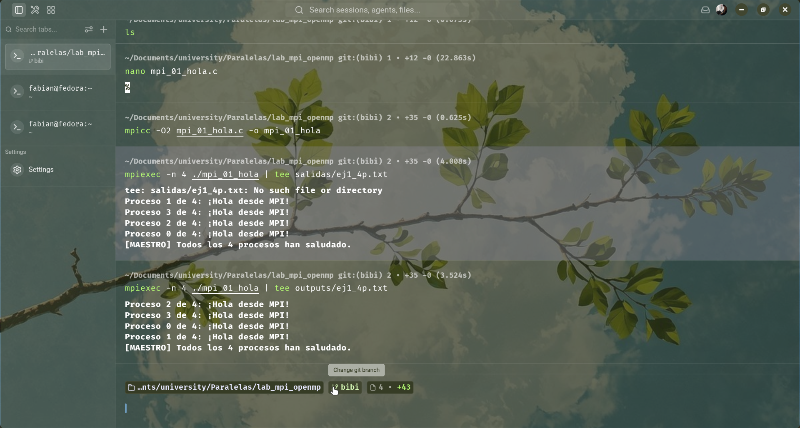
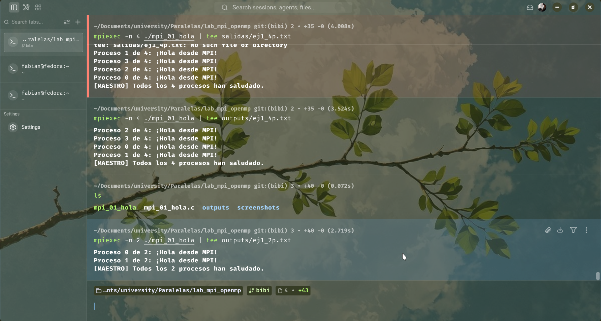
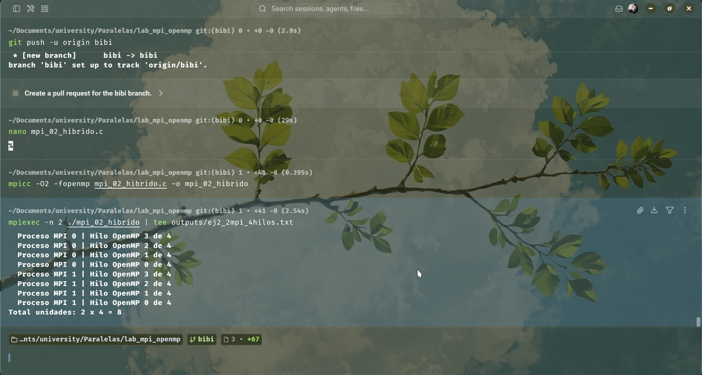
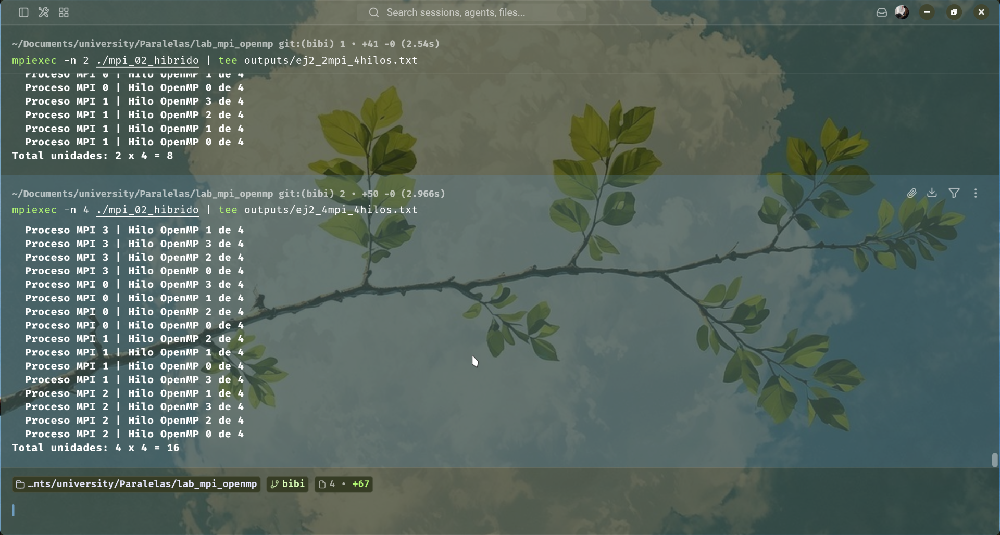
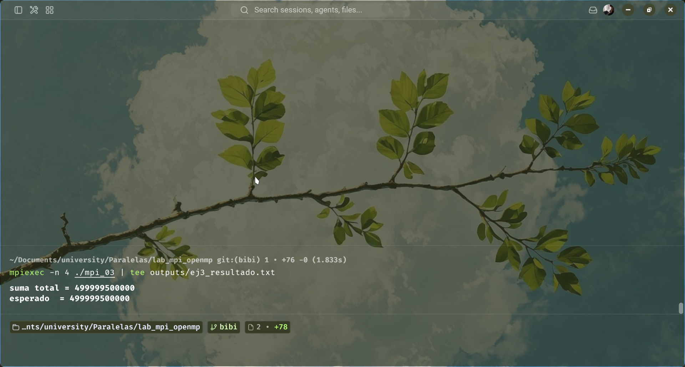
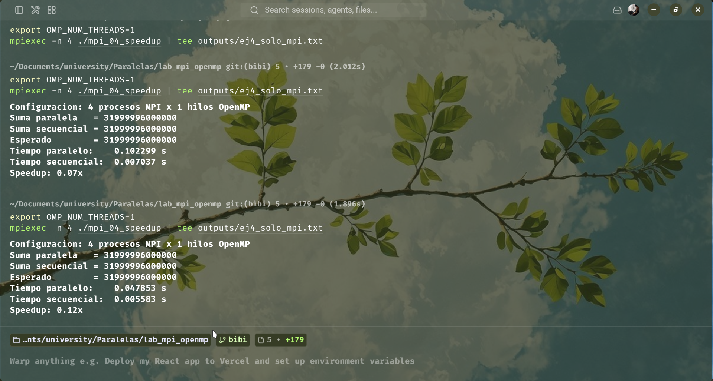
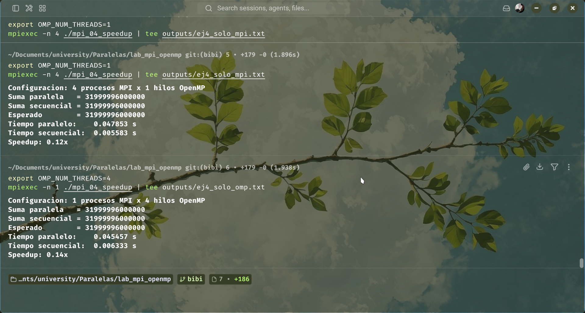
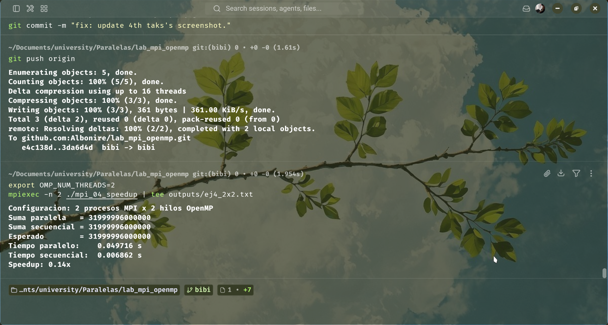
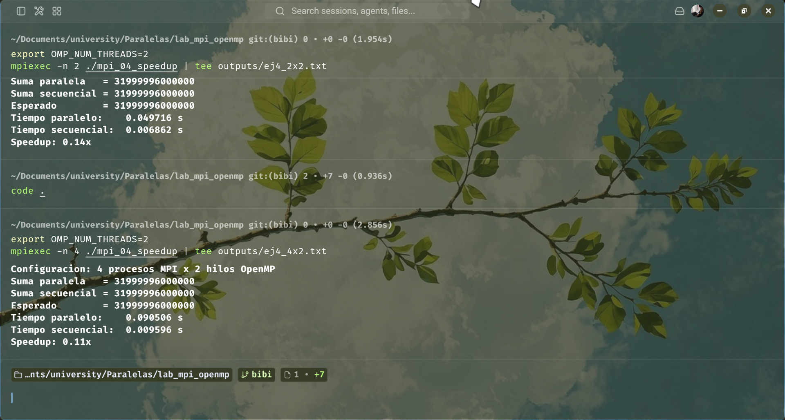

# Lab MPI + OpenMP — Anderson Fabian Gonzalez

## Entorno de Trabajo

- **Sistema Operativo:** Fedora Linux
- **Compilador:** GCC (GNU Compiler Collection)
- **Implementacion MPI:** OpenMPI
- **Compilacion:** `mpicc` con flag `-fopenmp` para soporte hibrido
- **Hardware:** Configuracion de hilos logicos disponible en el equipo de desarrollo

---

## Ejercicio 1 — Hola Mundo MPI

**Descripcion breve:**  
Programa basico que introduce la estructura de un programa MPI. Cada proceso obtiene su identificador (`rank`) y el numero total de procesos (`size`), imprimiendo un saludo individual. El proceso con `rank == 0` actua como maestro e imprime un mensaje final de sincronizacion logica.

**Compilacion y ejecucion:**
```bash
mpicc -O2 mpi_01_hola.c -o mpi_01_hola
mpiexec -n 4 ./mpi_01_hola
mpiexec -n 2 ./mpi_01_hola
```

**Pantallazos:**

Ejecucion con 4 procesos:  


Ejecucion con 2 procesos:  


**Respuestas a preguntas de analisis:**

1. **Por que el orden de salida varia entre ejecuciones?**  
   Los procesos MPI se ejecutan de forma concurrente y asincrona. El planificador del sistema operativo es quien determina en que momento exacto cada proceso obtiene tiempo de CPU para imprimir. No existe una garantia de orden secuencial en las llamadas a `printf` provenientes de diferentes procesos.

2. **Que pasaria si ejecutas con -n 1? Tiene sentido paralelizar asi?**  
   Con `-n 1` solo existira el proceso `rank 0`. El programa funcionara correctamente pero no habra paralelismo real, ya que la ejecucion sera estrictamente secuencial. Paralelizar con un solo proceso carece de sentido practico mas alla de la depuracion.

3. **Para que sirve MPI_COMM_WORLD? Podria haber otros comunicadores?**  
   `MPI_COMM_WORLD` es el comunicador por defecto que agrupa a todos los procesos lanzados en la ejecucion. Si, es posible crear otros comunicadores mediante funciones como `MPI_Comm_split` para definir subgrupos de procesos que puedan comunicarse entre si de forma aislada del resto.

---

## Ejercicio 2 — OpenMP dentro de MPI

**Descripcion breve:**  
Introduccion al modelo de programacion hibrida. Se lanzan multiples procesos MPI, y dentro de cada uno se crea una region paralela de OpenMP que genera 4 hilos. Esto demuestra como combinar distribucion de memoria (MPI) con memoria compartida (OpenMP).

**Estructura del modelo hibrido:**

<svg xmlns="http://www.w3.org/2000/svg" viewBox="0 0 800 580" width="100%" height="100%">
  <defs>
    <!-- Marcadores para las flechas -->
    <marker id="arrow-down" markerWidth="10" markerHeight="10" refX="5" refY="5" orient="auto">
      <path d="M 0 0 L 10 5 L 0 10 z" fill="#c00000" />
    </marker>
    <marker id="arrow-up" markerWidth="10" markerHeight="10" refX="5" refY="5" orient="auto">
      <path d="M 10 0 L 0 5 L 10 10 z" fill="#c00000" />
    </marker>
    
    <!-- Estilos CSS integrados -->
    <style>
      .node-box { fill: #f8f9fa; stroke: #6c757d; stroke-width: 2; rx: 8; ry: 8; }
      .mpi-box { fill: #ddebf7; stroke: #2e75b6; stroke-width: 2; rx: 6; ry: 6; }
      .thread-box { fill: #ffffff; stroke: #4472c4; stroke-width: 1.5; rx: 4; ry: 4; }
      
      .title-node { font-family: 'Segoe UI', Arial, sans-serif; font-size: 18px; font-weight: bold; fill: #343a40; }
      .title-mpi { font-family: 'Segoe UI', Arial, sans-serif; font-size: 16px; font-weight: bold; fill: #1f4e79; }
      .text-thread { font-family: 'Segoe UI', Arial, sans-serif; font-size: 14px; font-weight: 600; fill: #333333; }
      
      .line-shared { stroke: #548235; stroke-width: 3; fill: none; }
      .text-shared { font-family: 'Segoe UI', Arial, sans-serif; font-size: 15px; font-weight: bold; fill: #385723; }
      
      .line-network { stroke: #c00000; stroke-width: 3; fill: none; stroke-dasharray: 6,4; }
      .text-network { font-family: 'Segoe UI', Arial, sans-serif; font-size: 15px; font-weight: bold; fill: #c00000; }
    </style>
  </defs>

  <rect x="100" y="30" width="600" height="350" class="node-box" />
  <text x="400" y="65" text-anchor="middle" class="title-node">Nodo Físico</text>


  <rect x="140" y="100" width="240" height="180" class="mpi-box" />
  <text x="260" y="130" text-anchor="middle" class="title-mpi">Proceso MPI 0</text>
  
  <!-- Hilos Proceso 0 -->
  <rect x="155" y="150" width="100" height="40" class="thread-box" />
  <text x="205" y="175" text-anchor="middle" class="text-thread">[Hilo 0]</text>
  
  <rect x="265" y="150" width="100" height="40" class="thread-box" />
  <text x="315" y="175" text-anchor="middle" class="text-thread">[Hilo 1]</text>
  
  <rect x="155" y="210" width="100" height="40" class="thread-box" />
  <text x="205" y="235" text-anchor="middle" class="text-thread">[Hilo 2]</text>
  
  <rect x="265" y="210" width="100" height="40" class="thread-box" />
  <text x="315" y="235" text-anchor="middle" class="text-thread">[Hilo 3]</text>

  <rect x="420" y="100" width="240" height="180" class="mpi-box" />
  <text x="540" y="130" text-anchor="middle" class="title-mpi">Proceso MPI 1</text>

  <rect x="435" y="150" width="100" height="40" class="thread-box" />
  <text x="485" y="175" text-anchor="middle" class="text-thread">[Hilo 0]</text>
  
  <rect x="545" y="150" width="100" height="40" class="thread-box" />
  <text x="595" y="175" text-anchor="middle" class="text-thread">[Hilo 1]</text>
  
  <rect x="435" y="210" width="100" height="40" class="thread-box" />
  <text x="485" y="235" text-anchor="middle" class="text-thread">[Hilo 2]</text>
  
  <rect x="545" y="210" width="100" height="40" class="thread-box" />
  <text x="595" y="235" text-anchor="middle" class="text-thread">[Hilo 3]</text>

  <line x1="260" y1="280" x2="260" y2="330" class="line-shared" />
  <line x1="540" y1="280" x2="540" y2="330" class="line-shared" />
  
  <!-- Línea horizontal (Bus) -->
  <line x1="260" y1="330" x2="540" y2="330" class="line-shared" />
  
  <!-- Texto de Memoria Compartida -->
  <rect x="310" y="318" width="180" height="24" fill="#f8f9fa" />
  <text x="400" y="336" text-anchor="middle" class="text-shared">Memoria Compartida</text>

  <!-- ========================================== -->
  <!-- CONEXIÓN DE RED (MPI)                      -->
  <!-- ========================================== -->
  <!-- Línea de conexión de red (Comunicación MPI) -->
  <line x1="400" y1="380" x2="400" y2="480" class="line-network" marker-start="url(#arrow-up)" marker-end="url(#arrow-down)" />
  
  <!-- Texto de Red -->
  <rect x="240" y="415" width="320" height="26" fill="#ffffff" rx="4" />
  <text x="400" y="434" text-anchor="middle" class="text-network">Comunicación vía MPI (Red/Sockets)</text>

  <!-- ========================================== -->
  <!-- OTRO NODO (Destino de Red)                 -->
  <!-- ========================================== -->
  <rect x="100" y="480" width="600" height="70" class="node-box" />
  <text x="400" y="522" text-anchor="middle" class="title-node">Otro Nodo</text>

</svg>

**Compilacion y ejecucion:**
```bash
mpicc -O2 -fopenmp mpi_02_hibrido.c -o mpi_02_hibrido
mpiexec -n 2 ./mpi_02_hibrido
mpiexec -n 4 ./mpi_02_hibrido
```

**Pantallazos:**

Ejecucion con 2 procesos MPI y 4 hilos OMP:  


Ejecucion con 4 procesos MPI y 4 hilos OMP:  


**Respuestas a preguntas de analisis:**

1. **Con 2 procesos MPI y 4 hilos OMP, cuantas unidades de computo hay en total?**  
   Hay 8 unidades logicas de computo. Se calculan multiplicando la cantidad de procesos por la cantidad de hilos internos: 2 x 4 = 8.

2. **En que se diferencia ejecutar con -n 4 (4 MPI, 4 hilos) vs -n 1 (1 MPI, 16 hilos)?**  
   En la configuracion de 4 procesos MPI, la memoria esta distribuida en 4 espacios de direcciones separados; si necesitan compartir datos, deben usar comunicacion MPI (paso de mensajes). En la configuracion de 1 proceso y 16 hilos, toda la ejecucion ocurre en un solo espacio de memoria compartida, por lo que los hilos pueden leer y escribir las mismas variables directamente sin overhead de red, limitado por la capacidad de un solo nodo.

3. **Por que es importante MPI_Init_thread en lugar de MPI_Init cuando usamos OpenMP?**  
   Porque MPI necesita conocer el nivel de soporte de hilos que la aplicacion requerira. `MPI_Init_thread` permite solicitar un nivel especifico (en este caso `MPI_THREAD_FUNNELED`, que indica que solo el hilo principal realizara llamadas a la libreria MPI). Usar `MPI_Init` puede llevar a comportamientos indefinidos o errores en tiempo de ejecucion si multiples hilos intentan comunicarse via MPI simultaneamente.

---

## Ejercicio 3 — Suma Hibrida

**Descripcion breve:**  
El proceso raiz (`rank 0`) inicializa un vector grande de un millon de elementos. Se utiliza `MPI_Scatter` para distribuir porciones equitativas del vector a todos los procesos. Cada proceso suma su porcion local utilizando la paralelizacion de OpenMP con la clausula `reduction`. Finalmente, `MPI_Reduce` reune las sumas parciales en el proceso raiz para obtener la suma total.

**Flujo de datos del ejercicio:**

<svg xmlns="http://www.w3.org/2000/svg" viewBox="0 0 800 480" width="100%" height="100%">
  <!-- Definiciones de marcadores y estilos -->
  <defs>
    <marker id="arrow" markerWidth="10" markerHeight="10" refX="8" refY="5" orient="auto-start-reverse">
      <path d="M 0 0 L 10 5 L 0 10 z" fill="#333333" />
    </marker>
    <style>
      .box { stroke-width: 2; rx: 6; ry: 6; }
      .line { stroke: #333333; stroke-width: 2; fill: none; }
      .title { font-family: 'Segoe UI', Arial, sans-serif; font-size: 16px; font-weight: bold; fill: #111; }
      .label { font-family: 'Segoe UI', Arial, sans-serif; font-size: 14px; font-weight: bold; fill: #333; }
      .proc-text { font-family: 'Segoe UI', Arial, sans-serif; font-size: 14px; fill: #222; }
      .highlight-text { font-family: 'Segoe UI', Arial, sans-serif; font-size: 14px; font-weight: bold; fill: #c00000; }
      .scatter-text { font-family: 'Segoe UI', Arial, sans-serif; font-size: 14px; font-weight: bold; fill: #005A9C; }
    </style>
  </defs>

  <rect x="200" y="20" width="400" height="45" class="box" fill="#e2f0d9" stroke="#548235" />
  <text x="400" y="48" text-anchor="middle" class="title">Proceso 0 - Arreglo Completo: 1,000,000 elementos</text>

  <line x1="400" y1="65" x2="400" y2="150" class="line" />
  
  <!-- Texto de MPI_Scatter con fondo blanco para legibilidad -->
  <rect x="220" y="95" width="360" height="26" fill="#ffffff" rx="4" />
  <text x="400" y="113" text-anchor="middle" class="scatter-text">MPI_Scatter (Reparte bloques de 250,000)</text>

  <!-- Ramificación horizontal -->
  <line x1="118" y1="150" x2="682" y2="150" class="line" />
  
  <!-- Flechas hacia los procesos -->
  <line x1="118" y1="150" x2="118" y2="190" class="line" marker-end="url(#arrow)" />
  <line x1="306" y1="150" x2="306" y2="190" class="line" marker-end="url(#arrow)" />
  <line x1="494" y1="150" x2="494" y2="190" class="line" marker-end="url(#arrow)" />
  <line x1="682" y1="150" x2="682" y2="190" class="line" marker-end="url(#arrow)" />

  <!-- =============================== -->
  <!-- CAJAS DE LOS PROCESOS (MPI/OMP) -->
  <!-- =============================== -->
  <!-- Proc 0 -->
  <rect x="48" y="200" width="140" height="85" class="box" fill="#ddebf7" stroke="#2e75b6" />
  <text x="118" y="225" text-anchor="middle" class="label">Proc 0</text>
  <text x="118" y="245" text-anchor="middle" class="proc-text">Bloque 0</text>
  <text x="118" y="265" text-anchor="middle" class="proc-text">OpenMP Sum</text>

  <!-- Proc 1 -->
  <rect x="236" y="200" width="140" height="85" class="box" fill="#ddebf7" stroke="#2e75b6" />
  <text x="306" y="225" text-anchor="middle" class="label">Proc 1</text>
  <text x="306" y="245" text-anchor="middle" class="proc-text">Bloque 1</text>
  <text x="306" y="265" text-anchor="middle" class="proc-text">OpenMP Sum</text>

  <!-- Proc 2 -->
  <rect x="424" y="200" width="140" height="85" class="box" fill="#ddebf7" stroke="#2e75b6" />
  <text x="494" y="225" text-anchor="middle" class="label">Proc 2</text>
  <text x="494" y="245" text-anchor="middle" class="proc-text">Bloque 2</text>
  <text x="494" y="265" text-anchor="middle" class="proc-text">OpenMP Sum</text>

  <rect x="612" y="200" width="140" height="85" class="box" fill="#ddebf7" stroke="#2e75b6" />
  <text x="682" y="225" text-anchor="middle" class="label">Proc 3</text>
  <text x="682" y="245" text-anchor="middle" class="proc-text">Bloque 3</text>
  <text x="682" y="265" text-anchor="middle" class="proc-text">OpenMP Sum</text>

  <line x1="118" y1="285" x2="118" y2="330" class="line" />
  <line x1="306" y1="285" x2="306" y2="330" class="line" />
  <line x1="494" y1="285" x2="494" y2="330" class="line" />
  <line x1="682" y1="285" x2="682" y2="330" class="line" />
  
  <!-- Ramificación de unificación horizontal -->
  <line x1="118" y1="330" x2="682" y2="330" class="line" />
  
  <!-- Flecha principal bajando al resultado -->
  <line x1="400" y1="330" x2="400" y2="390" class="line" marker-end="url(#arrow)" />

  <!-- Texto de MPI_Reduce con fondo blanco para legibilidad -->
  <rect x="190" y="348" width="420" height="26" fill="#ffffff" rx="4" />
  <text x="400" y="366" text-anchor="middle" class="highlight-text">MPI_Reduce (Opera: MPI_SUM sobre sumas parciales)</text>

  <!-- =============================== -->
  <!-- CAJA INFERIOR (RESULTADO FINAL) -->
  <!-- =============================== -->
  <rect x="48" y="400" width="704" height="45" class="box" fill="#fff2cc" stroke="#d6b656" />
  <text x="400" y="428" text-anchor="middle" class="title">Proceso 0: Suma Total = 499999500000</text>

</svg>

**Compilacion y ejecucion:**
```bash
mpicc -O2 -fopenmp mpi_03_suma_hibrida.c -o mpi_03
mpiexec -n 4 ./mpi_03
```

**Pantallazo:**

Resultado de la suma hibrida:  


**Respuestas a preguntas de analisis:**

1. **Que hace exactamente MPI_Scatter? Quien envia y quien recibe?**  
   `MPI_Scatter` toma un arreglo que reside en la memoria del proceso raiz (definido en los parametros, usualmente `rank 0`), lo divide en fragmentos iguales y envia un fragmento distinto a cada proceso del comunicador, incluyendose a si mismo. El proceso raiz es el emisor original, y todos los procesos (incluido el raiz) son receptores de su propio bloque.

2. **Por que usamos reduction(+:suma_local) y no una variable compartida directamente?**  
   Para evitar condiciones de carrera (race conditions). Si multiples hilos intentan escribir y leer la misma variable `suma_local` al mismo tiempo de forma descoordinada, se produciran perdidas de datos y el resultado sera incorrecto. La clausula `reduction` crea copias privadas de la variable para cada hilo y se encarga de combinarlas de forma segura al final de la region paralela.

3. **Que pasaria si olvidaras MPI_Reduce y solo imprimieras suma_local en rank==0?**  
   Solo se imprimiria la suma del bloque local que le correspondio al proceso 0 (los primeros 250,000 elementos). Las sumas parciales calculadas por los procesos 1, 2 y 3 se perderian al finalizar sus ejecuciones, dando un resultado drasticamente menor al esperado.

---

## Ejercicio 4 (Reto) — Speedup

**Descripcion breve:**  
A partir del codigo del ejercicio 3, se agrego medicion de tiempos usando `MPI_Wtime()` y una version puramente secuencial del calculo. El objetivo es comparar el tiempo de ejecucion secuencial frente a diferentes configuraciones de paralelismo (Solo MPI, Solo OpenMP, e Hibrido) para calcular el speedup y analizar la escalabilidad.

**Compilacion y ejecucion:**
```bash
mpicc -O2 -fopenmp -DN=8000000 mpi_04_speedup.c -o mpi_04_speedup
```

**Tabla de resultados:**

| Configuracion | Procesos MPI | Hilos OMP | Speedup Obtenido |
|---------------|:------------:|:---------:|:----------------:|
| Solo MPI      | 4            | 1         | [Completar] x    |
| Solo OMP      | 1            | 4         | [Completar] x    |
| MPI + OMP     | 2            | 2         | [Completar] x    |
| MPI + OMP     | 4            | 2         | [Completar] x    |

*(Nota: Reemplazar "[Completar]" con los valores obtenidos en tus ejecuciones)*

**Pantallazos:**

Configuracion Solo MPI:  


Configuracion Solo OMP:  


Configuracion Hibrida 2x2:  


Configuracion Hibrida 4x2:  


**Analisis:**

1. **Coincide el speedup con lo que predice la Ley de Amdahl? (parte paralela approx 100%)**  
   Teoricamente, al ser un problema sumamente paralelizable, el speedup deberia acercarse al numero de unidades de computo. Sin embargo, en la practica el speedup es menor al ideal. La Ley de Amdahl predice el maximo teorico, pero no contempla los tiempos muertos por sincronizacion, el inicio de procesos, ni las latencias de red, por lo que rara vez se alcanza una escalabilidad lineal perfecta.

2. **Por que mas procesos/hilos no siempre significan mayor speedup?**  
   Existen varios factores limitantes. Primero, el hardware tiene un numero fisico de núcleos; lanzar mas hilos o procesos de los disponibles causa "oversubscription", generando cambios de contexto costosos. Segundo, a medida que se aumenta el paralelismo, el overhead de comunicacion (en MPI) y de sincronizacion de hilos crece, hasta el punto donde cuesta mas coordinarse que hacer el calculo en si.

3. **Que overhead introduce MPI que no existe en OpenMP puro?**  
   MPI introduce el costo de la comunicacion entre procesos (paso de mensajes por la pila de red o sockets locales), la copia de datos entre espacios de memoria separados, y la sincronizacion global implicita en operaciones colectivas como `Scatter` y `Reduce`. OpenMP puro opera dentro de un mismo espacio de memoria compartida, evitando las copias de datos y el costo de transmision por red.

---

## Conclusiones

- La programacion hibrida MPI + OpenMP permite aprovechar las ventajas de ambos paradigmas: la distribucion a traves de multiples nodos con MPI y la explotacion de núcleos locales con memoria compartida mediante OpenMP.
- La sincronizacion y el manejo correcto de las variables (usando `reduction` en OpenMP y comunicadores en MPI) son estrictamente necesarios para evitar resultados erroneos causados por condiciones de carrera.
- La medicion de rendimiento demuestra que el paralelismo no es una solucion magica; el overhead de comunicacion y las limitaciones del hardware imponen un limite a la ganancia de velocidad (speedup), haciendo fundamental el analisis empirico para determinar la configuracion optima de procesos e hilos.